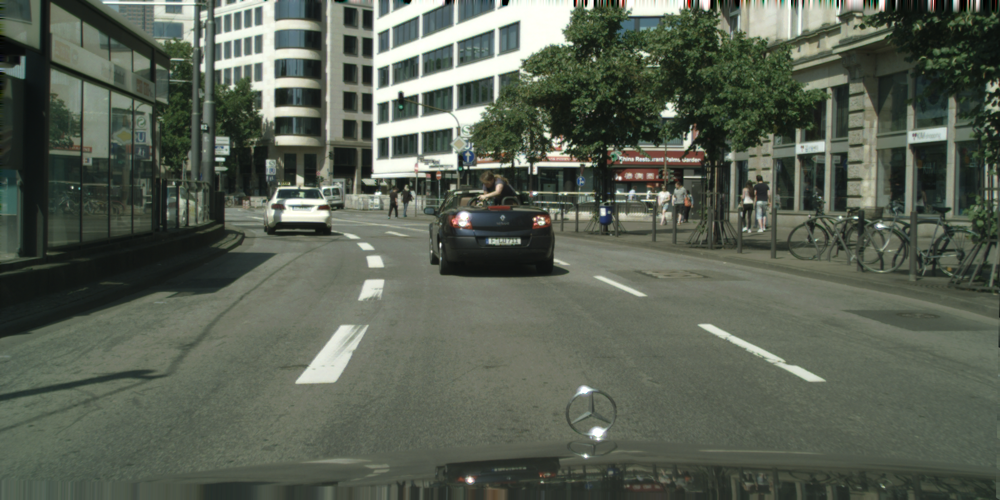

# Customized Fisheye Augmentation 

This scripts to conver the pinholde dataset to fiseye dataset include image, semantic segmentation, instance segmentation, polygons and 2d bouding box. Modify for Cityscape and BDD100K (working) dataset
## Requirements

## Convert to Fisheye

```bash
python DataGenerator.py --base_dir "path_contain_datasets" --mode ['train', 'val'] --dataset ['cityscape', 'bdd100k']
``` 


## Convert 2D bouding box follow COCO format

create directory:
```bash
mkir /path_of_fisheye_dataset/annotations
```
convert:
```bash
python data2coco.py --datadir "path_of_fisheye_dataset" --outdir "path_of_fisheye_dataset/annotations"
```

## Visualization

```bash
mkdir outputs

python inspect_coco.py --coco_dir "path_of_fisheye_dataset" --num_examples 5
```

| Original image        | Fisheye        |
|-----------------|----------------|
|  | .png) |
| Segmentation        | 2d Bouding box        |
| .png) | .png) |