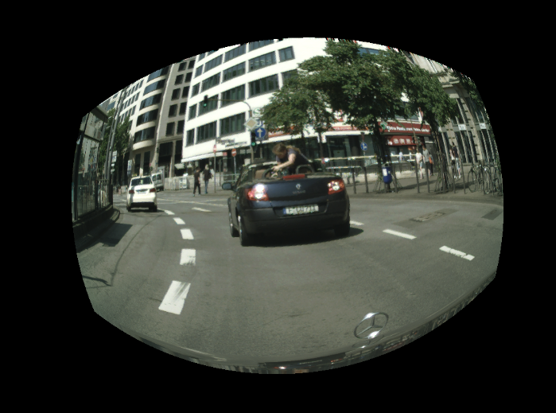
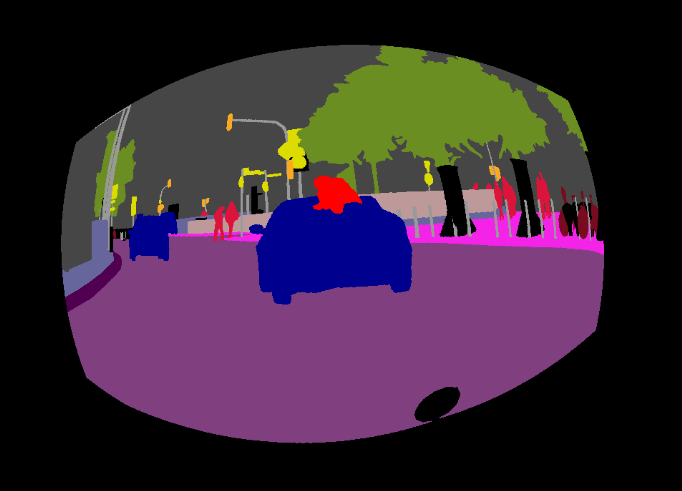
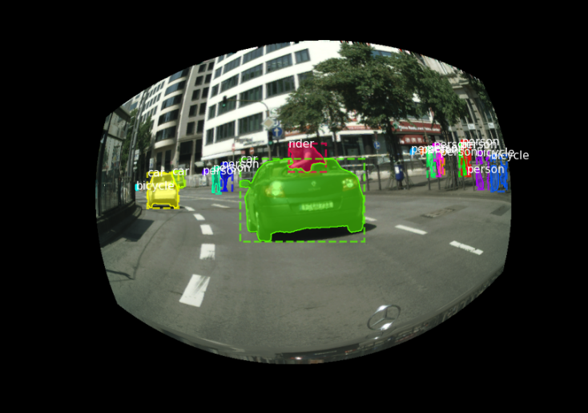

# Customized Fisheye Augmentation 

This script converts a pinhole dataset to a fisheye dataset, including images, semantic segmentation, instance segmentation, polygons, and 2D bounding boxes. It is compatible with the Cityscape and BDD100K (pending) datasets.


## Convert to Fisheye

```bash
python DataGenerator.py --base_dir "path_contain_datasets" --mode <train|val> --dataset <cityscape|bdd100k>
```

## Convert 2D Bounding Box to COCO Format

Create the directory:
```bash
mkdir /path_of_fisheye_dataset/annotations
```

Convert:
```bash
python data2coco.py --datadir "path_of_fisheye_dataset" --outdir "path_of_fisheye_dataset/annotations"
```

## Visualization

Create the output directory:
```bash
mkdir outputs
```

Run visualization:
```bash
python inspect_coco.py --coco_dir "path_of_fisheye_dataset" --num_examples 5
```

### Sample

<table>
  <tr>
    <th style="text-align: center;">Original Image</th>
    <th style="text-align: center;">Fisheye Transformation</th>
  </tr>
  <tr>
    <td style="text-align: center;">
      
    </td>
    <td style="text-align: center;">
      
    </td>
  </tr>
  <tr>
    <th style="text-align: center;">Segmentation Output</th>
    <th style="text-align: center;">2D Bounding Box</th>
  </tr>
  <tr>
    <td style="text-align: center;">
      
    </td>
    <td style="text-align: center;">
      
    </td>
  </tr>
</table>

## Acknowledgements

This repo builds upon the contributions of the following repositories:
- [FisheyeSeg](https://github.com/Yaozhuwa/FisheyeSeg/tree/master)
- [cityscapes-to-coco-conversion](https://github.com/TillBeemelmanns/cityscapes-to-coco-conversion)

